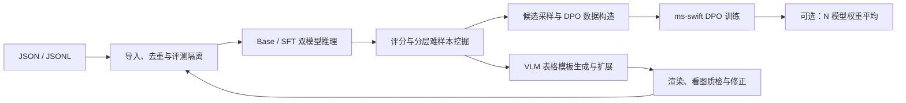

# DataFlywheel · PaddleOCR-VL-1.6

用于裁剪后的 table/text/formula 图片：双模型推理、GT 评分、退化挖掘、DPO 偏好构造、ms-swift 全参训练和完整模型权重平均。支持从表格 hardcase 出发，用 OpenAI 兼容 VLM 生成模板、扩展内容与结构，并通过渲染和看图反馈迭代修正。报告为离线 HTML；完整页级推理独立运行，输出供 OmniDocBench Docker 评分。

本项目借鉴 [OvisOCR2 §3.3.1/§3.5](https://arxiv.org/html/2607.13639v1) 的可学习难样本和参数融合思想；OvisOCR2 使用 GRPO，本项目使用 DPO。所有挖掘阈值、配比与融合权重均为实验参数，不是论文未公开配方的复现。

## 流程与命令



| 命令 | 用途 |
|---|---|
| `convert` | 字段统一、HTML/OTSL 转换、去重和评测隔离 |
| `infer` / `score` / `mine` | 双模型推理、任务评分、分层挖掘 |
| `build-dpo` / `report` | 偏好对、审计和离线报告 |
| `run` | 串联导入到 DPO 数据与报告，不启动训练 |
| `synth-template` / `synth-render` / `synth-check` | 不调用模型的表格参数化合成与校验 |
| `synth-agent` | VLM 看图生成/扩展模板，渲染后看图修正 |
| `train` | ms-swift 预检查、单卡或 DDP 全参 DPO |
| `parse-pages` | 官方页级产线输出，供独立 OmniDocBench 评测 |
| `average` | 同架构 HF 完整 checkpoint 的加权平均 |

主流程配置见 [default.yaml](configs/default.yaml)，多卡训练见 [train-ddp.yaml](configs/train-ddp.yaml)，合成 VLM 见 [synthesis-vlm.yaml](configs/synthesis-vlm.yaml)。合成模型与挖掘用的 Base/SFT 模型分别配置，可以部署在不同服务。

## 安装与快速体验

本项目直接运行源码，要求 Python 3.10 或更新版本。无需 `pip install .`，不注册独立命令。以下命令均在仓库根目录执行：

```bash
git clone https://github.com/yogurtss/DataFlywheel.git
cd DataFlywheel
```

建议数据工程、训练、PaddleOCR 页级产线、CDM 分开环境，避免 Paddle/Transformers/TeX 依赖互相影响。各环境只安装所需依赖，始终通过仓库内脚本运行。

```bash
python -m venv .venv
source .venv/bin/activate
pip install -r requirements.txt
# 测试依赖（含权重平均所需的 CPU/GPU PyTorch）
pip install -r requirements-test.txt
python -m pytest -q
python main.py --help

# 无模型、无端口的完整软件演示；模拟响应不是模型精度验证。
python scripts/offline_demo.py runs/offline-demo
# 浏览 runs/offline-demo/result/report/index.html
```

依赖按用途拆分，扩展文件均包含基础依赖：

| 用途 | 安装命令 |
|---|---|
| 导入、双模型推理、评分、挖掘、DPO 导出和报告 | `pip install -r requirements.txt` |
| 表格合成与 VLM Agent | `pip install -r requirements-synth.txt`，另安装 Chromium |
| 权重平均 | `pip install -r requirements-average.txt` |
| ms-swift DPO 训练 | `pip install -r requirements-train.txt` |
| 官方页级产线 | `pip install -r requirements-pages.txt` |
| 自动测试 | `pip install -r requirements-test.txt` |

[验证记录](docs/VALIDATION.md) 区分本地测试、模拟服务和真实硬件验证。`requirements-core.lock` 固定本地实际测试的核心版本；训练依赖不会冒充已经 GPU 验证的锁文件。成功完成真实训练后，输出目录自动记录 `requirements.verified.txt`。

## 输入与表格转换

### 直接使用 ERNIE / PaddleOCR-VL 官方 SFT JSONL

可直接输入 [ERNIE 官方 SFT 格式](https://github.com/PaddlePaddle/ERNIE/blob/release/v1.5/docs/paddleocr_vl_sft_zh.md)，不必手动转换字段，不要求 text/table/formula 按比例出现。每行一个裁剪区域和一轮问答，下面三类可任意混合，也可以整个文件只有表格：

```jsonl
{"image_info":[{"image_url":"images/text.png","matched_text_index":0}],"text_info":[{"text":"OCR:","tag":"mask"},{"text":"文本标注","tag":"no_mask"}]}
{"image_info":[{"image_url":"images/table.png","matched_text_index":0}],"text_info":[{"text":"Table Recognition:","tag":"mask"},{"text":"<fcel>A<fcel>B<nl>","tag":"no_mask"}]}
{"image_info":[{"image_url":"images/formula.png","matched_text_index":0}],"text_info":[{"text":"Formula Recognition:","tag":"mask"},{"text":"x^{2}+1","tag":"no_mask"}]}
```

程序从 `mask` 提示词识别任务，从 `no_mask` 答案取得 GT，按样本自动路由指标：

| 提示词 | 任务与标注 | 主指标 |
|---|---|---|
| `OCR:` | text，原文 | `1-NED`，附 CER/WER |
| `Table Recognition:` | table，OTSL（也接受合法 HTML） | HTML 表示上的 TEDS，附 TEDS-S |
| `Formula Recognition:` | formula，LaTeX | 默认 CDM；显式 `fast` 时用编辑距离代理 |

任务由提示词决定，不因 OCR 文本含数学符号就误判公式。原 `image_info/text_info` 保留供审计。无需提供 `id/task/gt_format/source/domain`；已有 `document_id/parent_document_id/split` 仍用于评测隔离，缺少文档信息时无法仅凭图片确定其是否来自评测页。

```bash
# 配置 default.yaml 中的两套推理服务后，一条命令构建 DPO
python main.py run -i /data/ocr_vl_sft-train.jsonl -o runs/round1 -c configs/default.yaml
# 或仅检查/转换输入，查看错误清单，再分阶段运行
python main.py convert -i /data/ocr_vl_sft-train.jsonl -o runs/normalized.jsonl -c configs/default.yaml
```

本地图片默认相对 JSONL 所在目录；`data.image_root` 可指定根目录。HTTP(S) `image_url` 自动下载到 `data.image_cache`，检查大小上限和可读性，再哈希去重；缓存按 URL 复用，远程同 URL 内容变更后应清理对应缓存。多图、多轮、system/video/tool 上下文、未知任务（包括 Chart Recognition）和冲突标注进入导入错误清单，不套用不合适的 OCR 指标。

默认 `mixture.task: null`、`mixture.domain: null`，**不施加任务或来源配额，也不强制保持输入比例**。全部有效输入先完成双模型确定性推理和评分，再按退化、难度、偏好间隔及预算选样，最终各类数量由有效样本决定。`mining.budget` 仍是最终偏好对数量上限；追加采样限于 shortlist，未入选原因有记录。只有 text/table 时不要求 CDM；含 formula 时默认需要 CDM，缺依赖明确报错。

旧配置若仍写有 `mixture.task: {table: 0.5, text: 0.3, formula: 0.2}`，请改为 `null` 或删除该项；来源配额同理。需要配额的对照实验仍可显式配置比例。

### 兼容统一 JSON / JSONL

JSON list 或 JSONL，每条对应一个裁剪图。`image` 相对输入文件目录解析，其余配置路径相对命令运行目录解析。最小输入：

```json
[
  {"id":"t1","image":"table.png","task":"table","html":"<table><tr><td>A</td><td>B</td></tr></table>","source":"my_tables","domain":"private","document_id":"doc-1","split":"train"},
  {"id":"x1","image":"text.png","task":"text","text":"文本标注","source":"general_text","domain":"general","document_id":"doc-2","split":"train"},
  {"id":"f1","image":"formula.png","task":"formula","latex":"x^{2}+y^{2}=z^{2}","domain":"general","document_id":"doc-3","split":"train"}
]
```

也可统一写 `gt` 和 `gt_format`（`html/otsl/text/latex`）。`fields` 可映射已有字段：`{image: image_path, task: category, document_id: doc_id}`。其他元数据原样保留，`language` 用于报告；`source` 是数据集名称，`domain` 默认是 `private`，可标记为 `general` 或自定义来源分组。存储业务域时可用额外字段 `business_domain`。

```bash
python main.py convert -i data/input.json -o runs/normalized.jsonl -c configs/default.yaml
# 同一功能的独立手动脚本：
python scripts/html_to_otsl.py -i data/input.json -o runs/normalized.jsonl
```

输出保留 `raw_annotation`、`gt`、`target`、`score_gt`；表格补充 `otsl`，评分表示为规范 HTML。冲突、嵌套表格、无法表示的结构写入 `.errors.jsonl`。不会覆盖输入。

OTSL 使用官方的 `<fcel>/<ecel>/<lcel>/<ucel>/<xcel>/<nl>`。单元格文本在 OTSL 中保持原文，HTML 导出时才转义；HTML `<br>` 转为单元格内换行。表头标签、字体和样式不属于 OTSL 表达能力，原 HTML 保留用于审计。字面内容含 OTSL 分隔符时隔离，不生成有歧义的目标。严格解码不执行官方产线的补格/截断修复，因此区域挖掘 TEDS 与带修复的页级结果可能不同。

### 防止评测泄漏

- 为同一文档的整页及所有裁剪图提供相同 `document_id`，或提供 `parent_document_id`；仅靠图片哈希无法知道任意裁剪图来自哪张评测页。
- 输入中任意 `eval/val/test/validation` 文档会阻止同文档训练数据进入训练池。`data.exclude_manifests` 可加载外部评测清单，支持文档 ID、图片/父图哈希。
- 对图像文件和 RGB 像素分别计算哈希，去掉完全重复图；重复图 GT 冲突时双方隔离。没有实现感知近重复检测，压缩/裁剪变体仍需可靠文档来源。
- `data.eval_fraction` 可按文档稳定划分保留集，默认 0；它不启用训练期评测。
- 无 GT 可推理、查看分歧，但不能自动获得偏好方向；可信 GT 默认 `gt_trusted: true`，疑似伪标注可设为 false。

## 双模型推理与挖掘

修改 [configs/default.yaml](configs/default.yaml) 中两套 `base_url`（带 `/v1`）、`model` 与 `revision`。每次更换服务权重必须更换 revision，建议填 checkpoint 内容摘要。凭据只从 `api_key_env` 指向的环境变量读取。

任务提示词固定对应 `OCR:`、`Table Recognition:`、`Formula Recognition:`。发送 RGB 图片数据 URL；服务端须使用 PaddleOCR-VL-1.6 官方 tokenizer、chat template 和 processor。客户端默认不缩放，只转换 RGB；若配置 `max_side`，推理和 DPO 都使用缓存中的同一处理后 PNG。

服务端动态分辨率参数须与训练 `max_pixels` 保持一致（默认 1003520）。vLLM 等可通过 endpoint 的 `extra_body.mm_processor_kwargs` 显式传入，具体支持以服务版本为准；请求、参数、预处理、权重 revision 全部进入缓存键。完整 PaddleOCR 产线接口不是 `infer` 所需的裁剪图 VLM 接口。

```bash
python main.py run -i data/input.json -o runs/round1 -c configs/default.yaml
```

`run` 只进行数据工程，不启动训练：

1. 导入与隔离，先检查 CDM 是否可用。
2. 双模型各一次确定性推理并评分，保留所有原始响应。
3. 选取最多 `3 × budget` 的候选池，分桶为退化、可学习中等难度、覆盖性样本。
4. 仅对候选池追加默认 4 次 SFT 采样，重算评分和分桶。
5. 构造有效偏好对，按难度桶和优先级选到 `budget`；任务/来源配额仅在显式配置时启用。
6. 写出 DPO、审计、待处理清单及 HTML 报告。

样本综合分：`0.4×GT误差 + 0.4×退化 + 0.2×模型分歧`，缺失项仅用于诊断时按可用权重归一化。退化是 `max(base_score-sft_score, 0)`；输出不同并不意味着原模型更好。默认退化阈值 0.05，中等难度为任务内误差的 20–80 百分位，候选分差至少 0.05。

默认不限制私有/通用或 table/text/formula 比例，保留退化/可学习/覆盖 40/40/20 的难度桶预算。显式设置的配额用最大余数法取整；不足时从其余可用样本补齐，不重复采样，`.stats.json` 记录补齐前缺口和实际比例。极难但有可信 GT 的样本仍可在 hybrid/gt_pair 中被选中；它们不会因为分数最低就自动获得全部预算。

独立阶段便于复用推理缓存：

```bash
python main.py infer -i runs/normalized.jsonl -o runs/inferred.jsonl --cache runs/cache -c configs/default.yaml
python main.py score -i runs/inferred.jsonl -o runs/scored.jsonl -c configs/default.yaml
python main.py mine -i runs/scored.jsonl -o runs/mined.jsonl -c configs/default.yaml
python main.py infer --sampling -i runs/mined.jsonl -o runs/sampled.jsonl --cache runs/cache -c configs/default.yaml
python main.py score -i runs/sampled.jsonl -o runs/sampled.scored.jsonl -c configs/default.yaml

python main.py build-dpo -i runs/sampled.scored.jsonl -o runs/model-pairs.jsonl --mode model_pair -c configs/default.yaml
python main.py build-dpo -i runs/sampled.scored.jsonl -o runs/gt-pairs.jsonl --mode gt_pair -c configs/default.yaml
python main.py build-dpo -i runs/sampled.scored.jsonl -o runs/hybrid-pairs.jsonl --mode hybrid -c configs/default.yaml
```

默认 hybrid：先选达到质量门槛的模型正例，缺少时使用可信 GT。model_pair 不使用 GT 文本作为答案，只用它评分。负例优先 SFT 输出，选满足分差条件的最接近正例者。表格阈值 0.85、文本 0.95、公式 0.90；代理公式模式的阈值是代理分数，需独立调参。一个图片最多一个偏好对。

传输错误、结束原因缺失、长度截断、评测失败、相同/规范化等价答案不进入偏好对。非法表格输出可以是负例，正例必须合法。模型答案原文不被评分归一化改写。

### CDM 环境

本项目桥接 [OmniDocBench 的 `src.metrics.cdm.cdm.cdm_metrics`](https://github.com/opendatalab/OmniDocBench)，不是自行实现一个名为 CDM 的字符串指标。按照官方说明安装 TeX Live、Ghostscript 和对应 Python 环境，配置：

```yaml
metrics:
  formula: cdm
  cdm_repo: /workspace/OmniDocBench
  cdm_python: /opt/conda/envs/omnidocbench/bin/python
  timeout: 120
```

CDM 在独立进程中运行并先进行 `x+1` 自匹配检查。工具缺失、超时、GT 渲染失败、非空预测没有渲染 token 时返回 `metric_error`，不会当成识别零分。当前桥接的是包含上述 `src/` 路径的官方版本；旧版须升级或使用单独环境。请固定你使用的 OmniDocBench commit。

无 CDM 环境时显式设置 `metrics.formula: fast`，使用 `formula_edit_proxy`。CER 以 GT 长度为分母，可以大于 1；挖掘主分数始终为 `[0,1]` 的 `1-NED`。区域 TEDS 采用 IBM 树编辑成本并先规范化表格，不能冒充官方页级整体分数。

## ms-swift 单卡 / 多卡 DPO

训练环境安装支持 PaddleOCR-VL-1.6 的 ms-swift 4.x 和 Transformers 5.x：

```bash
pip install -r requirements-train.txt
# 先查看命令（只做数据/图片检查，不加载模板）
python main.py train -i runs/round1/dpo.jsonl -o runs/train1 -c configs/default.yaml --dry-run
# 用真实模板编码两侧答案，包含视觉 token；失败时不会启动训练
python main.py train -i runs/round1/dpo.jsonl -o runs/train1 -c configs/default.yaml --preflight-only
# 单卡
python main.py train -i runs/round1/dpo.jsonl -o runs/train1 -c configs/default.yaml
# 多卡 DDP，修改模型路径与 GPU 配置后执行
python main.py train -i runs/round1/dpo.jsonl -o runs/train-ddp -c configs/train-ddp.yaml
```

当前官方注册使用 `model_type=paddleocr_vl`、`template=paddle_ocr_1_5`，1.6 沿用该模板；不是使用原版 `paddle_ocr`。采用 `--tuner_type full`，视觉编码器和对齐模块均不冻结，不使用 ZeRO。多卡各卡保留 policy/reference，显存需求由你的输入长度和批量决定。

policy 与 reference 默认均来自 SFT checkpoint；原始模型只是挖掘对照。默认 sigmoid DPO、beta 0.1、学习率 1e-6、1 epoch、BF16、梯度检查点。`rpo_alpha: null` 为纯 DPO，设置数值则启用 ms-swift 的 chosen NLL 混合项，它不是另一个独立回放 SFT 数据集。

训练不评测：`split_dataset_ratio=0`、`eval_strategy=no`、不按评测择优。超长、无有效 loss token 的样本在 `preflight.errors.jsonl` 报告，必须显式修正/过滤再运行，不自动截断。训练记录写 `train.log`，配置与精确 argv 写 `launch.json`。ms-swift 模型/模板 API 不兼容时直接失败，不静默换模型或模板。

## 静态报告

```bash
python main.py report -i runs/round1/dpo.selected.jsonl -o runs/review \
  --before runs/round1/scored.jsonl --pending runs/round1/dpo.pending.jsonl
```

双击 `index.html` 即可离线查看：任务/来源/域/语言分布、GT 长度、表格复杂度、双模型散点图、退化与候选间隔、筛选配比、排除原因。分页样本提供图片、GT、候选与偏好来源。表格渲染为安全 HTML；公式用本地 MathML（预览不等于 CDM，复杂宏不支持时保留原文）。无 CDN，无额外 Web 服务。

## 完整页级推理 → 自行运行 OmniDocBench Docker

准备 `pages.json`：`[{"image":"page_001.jpg"}, ...]`。图片文件名须与 OmniDocBench 对应，每条是一页；PDF 需先按官方评测渲染设置转页图。

```bash
# 在官方 PaddleOCR-VL-1.6 产线环境中，进入仓库根目录执行：
pip install -r requirements-pages.txt
python main.py parse-pages -i data/pages.json -o runs/omni/base --role base -c configs/default.yaml
python main.py parse-pages -i data/pages.json -o runs/omni/sft --role sft -c configs/default.yaml
```

两次使用同一 `pages.options` 中的版面模型与预处理，连接不同 VLM。产物是 `markdown/<原图名>.md`、`json/<原图名>.json` 和带模型/产线配置的 `manifest.json`。不同模型请用不同输出目录。将 `markdown/` 挂载进你的官方 Docker 并在官方配置中设置 prediction path；本项目不调用 Docker 评分，也不将此步骤挂入训练。

## N 模型加权平均

```bash
pip install -r requirements-average.txt
python main.py average --models /models/base /models/sft /models/dpo \
  --weights 0.2 0.3 0.5 --output /models/fused --dtype bfloat16 --shard-mb 2000
```

不传 weights 时等权。只接受完整 HF safetensors（单文件/分片），建议全部来自同一基座的训练分支。必须同架构、同词表、同 tokenizer/processor/custom code、同张量键和形状。配置路径、dtype、Transformers 版本这些非架构字段可不同；其他配置保守要求一致。

浮点张量 FP32 累加后转换输出 dtype；非浮点 buffer 必须相同，含非有限值失败。检查声明绑定且同时存储的 embedding/lm_head；不同绑定存储键集合不自动猜测合并。拒绝未合并 LoRA、量化权重及已有输出目录。按张量/输出分片处理内存，不同时加载 N 个完整模型；单张量本身大于 shard budget 时允许独占分片。

输出包括 config、tokenizer、processor、所需本地自定义代码、权重、`fusion.json`。不平均优化器，不提供从融合结果继续原 optimizer 状态训练的支持。权重平均不保证通用精度改善，按你的离线评测选择权重。

## 通用回放数据

| 来源 | 优先用途 | 注意 |
|---|---|---|
| [PubTabNet](https://github.com/ibm-aur-nlp/PubTabNet) | 科学文档表格，HTML→OTSL | 使用 train，保留文档来源 |
| [UniMER-1M](https://github.com/opendatalab/UniMERNet) | 多种公式识别 | UniMER-Test 留作评测 |
| [DocStruct4M](https://github.com/X-PLUG/mPLUG-DocOwl/tree/main/DocOwl1.5) | 多来源文档文本/结构补充 | 筛选解析标注，不能把问答当 OCR GT |
| [olmOCR-mix](https://github.com/allenai/olmocr/blob/main/olmocr/train/README.md) | 文档、书籍等通用分布 | 模型生成标注需质检，整页 GT 不可直接分配给裁剪图 |

这些数据不是 OmniDocBench 的同分布替代品。为了保留原模型能力，通用池应同时覆盖中英文、科学/金融/书籍/扫描件，以及不同长度与表格复杂度；依据你已有 OmniDocBench 退化分项调整输入来源。第一版接收统一 JSON，不自动下载这些数据。OmniDocBench 及衍生裁剪只作评测。

## 表格合成管线（可运行试验版）

`synth-template → synth-render → synth-check` 提供 **GT 驱动的表格参数化合成**，输出可直接交给现有 `convert/run`。这组三个命令不调用模型；另有下文的 `synth-agent`，使用 VLM 看图生成新结构并迭代修正。两条路径目前均只支持 table，尚未实现 text/formula 合成。

```bash
pip install -r requirements-synth.txt
python -m playwright install --with-deps chromium

# 不指定输入时生成四种内置演示模板。
python main.py synth-template -o runs/synth/templates.jsonl
# 或从真实难样本 GT 提取结构；建议输入已完成去重与评测隔离的产物。
python main.py synth-template -i runs/round1/sampled.scored.jsonl -o runs/synth/hardcase-templates.jsonl

# 指定覆盖所需字符的本地字体，例如 NotoSansCJKsc-Regular.otf。
python main.py synth-render -i runs/synth/templates.jsonl -o runs/synth/rendered \
  --font /path/to/NotoSansCJKsc-Regular.otf --variants 2 --seed 42
python main.py synth-check -i runs/synth/rendered/samples.jsonl -o runs/synth/checked.jsonl
python main.py convert -i runs/synth/checked.jsonl -o runs/synth/normalized.jsonl
# 端口配置好后用真实模型测量合成样本难度和偏好间隔：
python main.py run -i runs/synth/checked.jsonl -o runs/synth/mined -c configs/default.yaml
```

内置样本包括：中英合并表头、密集数字明细、窄列换行、联合跨行跨列。每个家族默认生成清晰版和轻度扫描版；后者调整数值、字号、间距与线条，再施加轻度旋转、模糊和 JPEG 压缩。结构来自合法单元格网格，原图截图与 HTML/OTSL GT 共用该网格。现阶段保留种子拓扑；不会声称简单改变 CSS 已覆盖所有结构困难。

输出目录必须不存在，避免覆盖前一批数据。`index.html` 为本地预览，`contact-sheet.jpg` 为总览；`images/` 为训练裁剪图，`pages/` 为带上下文的清晰整页，`html/` 为可复现页面，`specs/` 保存单元格、样式、原始 DOM 坐标和增强参数。字体在 `assets/` 保存一份，其旁边的 LICENSE 如存在则一并复制。

渲染等待字体加载，检查字体字符覆盖、DOM 文本与单元格一致性、溢出、网格/OTSL 往返；不合格样本写入 `failures.jsonl`。扫描增强在完整裁剪并加边后执行，旋转扩展画布。记录的 DOM 坐标明确对应**未增强整页**，不是增强后裁剪图坐标，不用于增强图的定位训练。

模板保留 `document_id`、`seed_sample_id`、`template_family_id` 和 train split；来源为评测或不可信 GT 的种子被拒绝。`domain` 继承 private/general，`origin=synthetic` 单独标记来源。外部评测清单须先通过现有 `convert` 隔离，不能用评测图片的 GT 制作训练模板。第一版没有真实/合成混合比例自动调参。

内置记录是明确标记的虚构内容，数值变化不保证财务或实验统计关系成立。预览证明渲染和标注链路可工作，**是否是模型 hardcase 必须通过真实模型推理确认**。

### VLM 看图生成、扩展和修正模板

新增 `synth-agent`，补齐真实 hardcase 图片 → VLM 初始模板 → 结构/内容扩展 → Chromium 渲染 → VLM 看图质检 → 有限次数修正。当前支持 **table**；这里的 Agent 是程序控制的循环，默认各阶段共用一个能看图的模型。不是论文未公开模型/提示词的精确复现，也不把生成样本直接认定为 hardcase：生成后仍需双模型推理和评分。

在 `configs/synthesis-vlm.yaml` 配置自己的 `synthesis.vlm.url`、`token`、`model`。URL 支持 `https://host/v1` 或完整 `https://host/v1/chat/completions`，不会替你添加 `/v1`。非空 `token` 优先，否则读取 `token_env`；无鉴权服务设置 `token: ""` 和 `token_env: null`。配置快照脱敏，不在审计中记录请求头。

```yaml
synthesis:
  vlm:
    url: http://127.0.0.1:8000/v1
    model: your-vision-model-name
    token: ""                     # 可直接填写；不要将真实凭据提交到 Git
    token_env: SYNTH_VLM_TOKEN     # token 为空时读取此环境变量
    timeout: 120
    retries: 2
    temperature: 0.3
    max_tokens: 8192
  max_seeds: 3
  templates_per_seed: 2
  max_repairs: 2
```

```bash
export SYNTH_VLM_TOKEN='your-token'
python main.py synth-agent \
  -c configs/synthesis-vlm.yaml -i runs/round1/shortlist.jsonl \
  -o runs/synthesis/vlm-run --font /path/to/NotoSansCJKsc-Regular.otf
```

需要前述 Playwright/Chromium 与覆盖生成字符的字体。接口使用 [OpenAI 图片消息格式](https://developers.openai.com/api/docs/guides/images-vision)：`POST /chat/completions`、Bearer token、`messages[].content` 中的 `text` 和 `image_url`（PNG base64 data URI）。模型应支持图片和 JSON 文本输出；无需强制 JSON response_format。看图阶段必须用 VLM；纯文本 LLM 无法完成此命令中的视觉质检。

输入接受统一 JSON/JSONL（也可直接用挖掘结果），按输入顺序限制种子数；继承文档身份和图片哈希，过滤评测文档、重复图及不可信种子。没有 GT 时也可从图像生成**新的合成表格**，不会把模型输出当成原图标注。模型只能返回表格 HTML 与受限尺寸/字体参数，程序重建单元格网格，不执行模型脚本或任意 CSS。

输出 `samples.jsonl` 只包含结构、字体、DOM 溢出检查与 VLM 质检均通过的样本，HTML/OTSL GT 来自实际渲染网格；`templates.jsonl` 保存入选模板，`audit.jsonl` 保存提案和反馈，`pending.jsonl` 保存修正预算耗尽的条目，`index.html` 链接本地预览。`trials/` 中可能包含未通过视觉质检的渲染结果，**不要将 trials 下的数据合并训练**。请求超时/限流有重试，截断或非法 JSON 会进入有限修正流程；不自动退回规则模板。目前按模板串行运行，输出目录必须新建，不支持断点恢复。

```bash
python main.py convert -i runs/synthesis/vlm-run/samples.jsonl -o runs/synthesis/vlm-normalized.jsonl
# 再接 infer/score/mine/build-dpo 或 run，确定候选难度和有效偏好。
```

## 验证状态与项目结构

当前完整自动测试 **71 项通过**。另有真实 Chromium 的 8 张规则合成样本，以及 2 张使用模拟 VLM 响应的 Agent 流程样本；后者覆盖一次看图反馈后的修正。模拟服务用于验证消息格式与控制流程，不代表真实 VLM 的生成质量。真实 PaddleOCR 推理、CDM、GPU DPO 和完整页级评测仍需在你的运行环境验收，详见 [验证边界](docs/VALIDATION.md) 和 [Agent 验证记录](docs/synthesis-agent-validation.json)。

可复现 Agent 流程测试（需要 Chromium、字体和一张本地图片；不调用真实 VLM）：

```bash
python scripts/smoke_synthesis_agent.py \
  --font /path/to/NotoSansCJKsc-Regular.otf \
  --image /path/to/table.png --output runs/agent-smoke
```

```text
main.py                  统一脚本入口：python main.py <命令>
dataflywheel/             项目内部模块，不作为独立库安装
requirements*.txt        基础及各功能所需依赖
pytest.ini               测试配置
configs/                 不含真实凭据的 YAML 配置模板
scripts/                 离线演示、转换和合成流程验证脚本
tests/                   自动测试
docs/                    验证记录和上游接口对照记录
requirements-core.lock   实际测试的核心依赖版本
```

源码仓库包含代码、配置模板、文档和测试。`runs/` 中的数据、图片、缓存、日志、报告与 checkpoint 不纳入版本管理；通过上述命令在本地生成。个人配置可保存为 `configs/*.local.yaml`，凭据可使用环境变量。许可证及第三方来源见 [LICENSE](LICENSE) 和 [THIRD_PARTY.md](THIRD_PARTY.md)。
